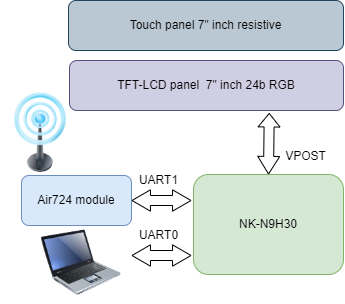
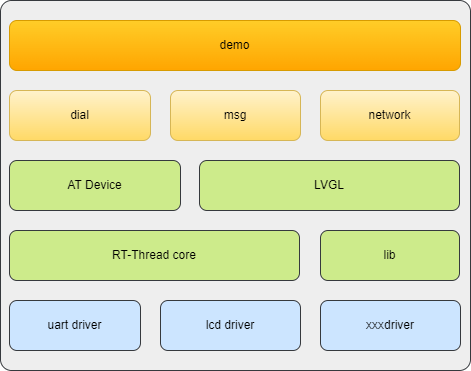
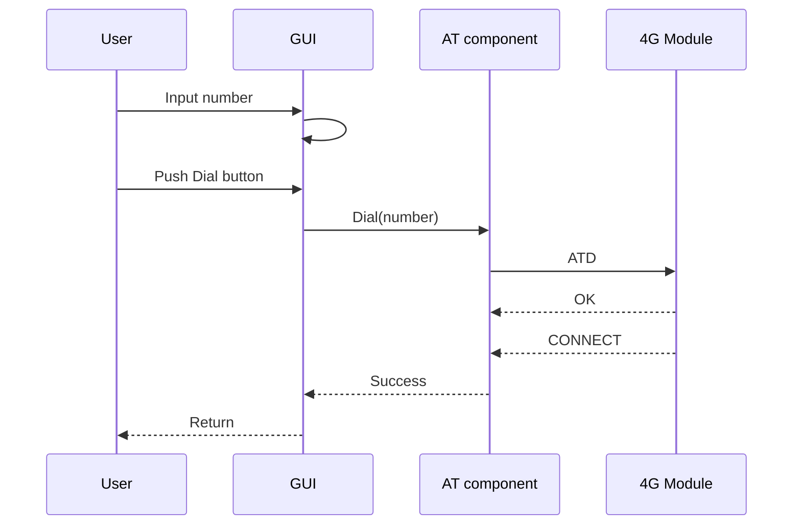
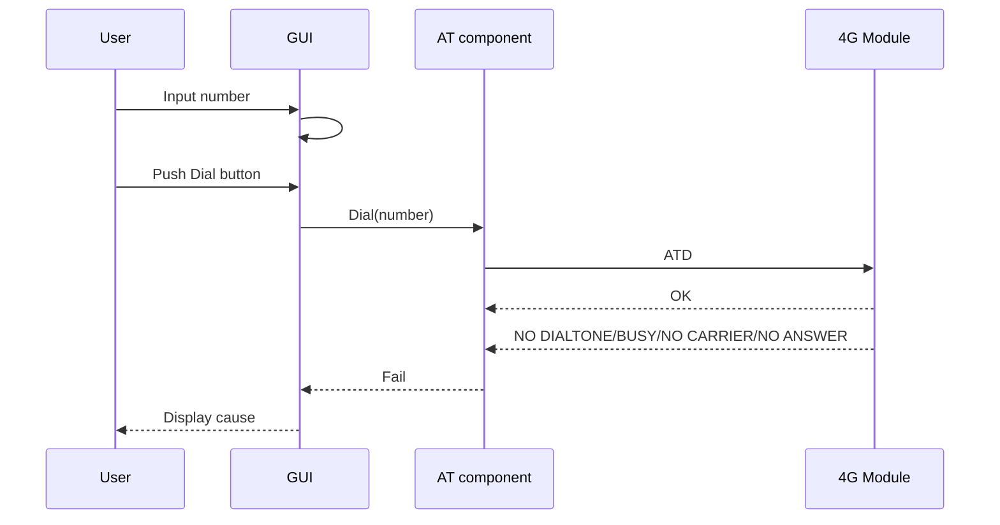
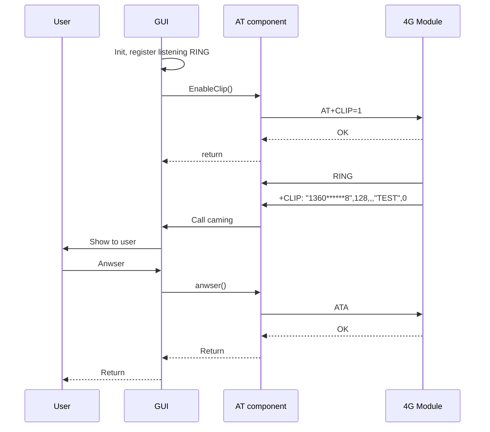
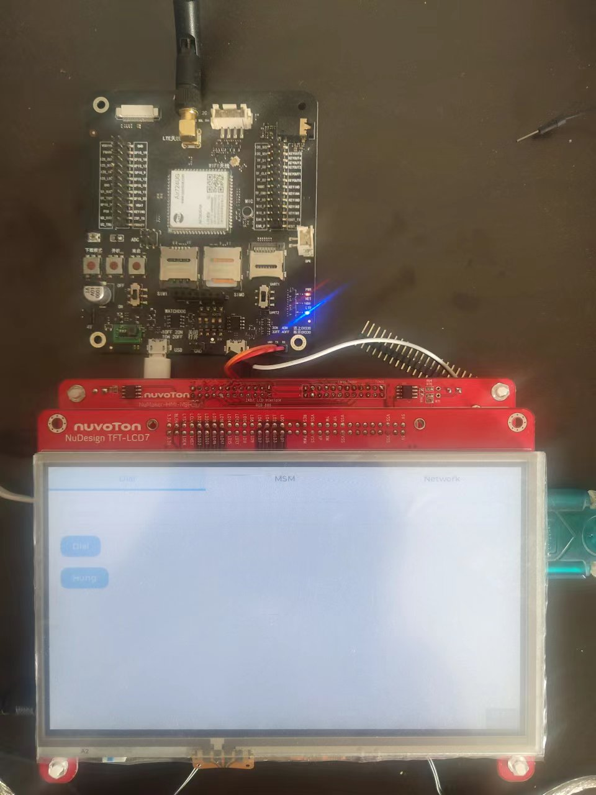
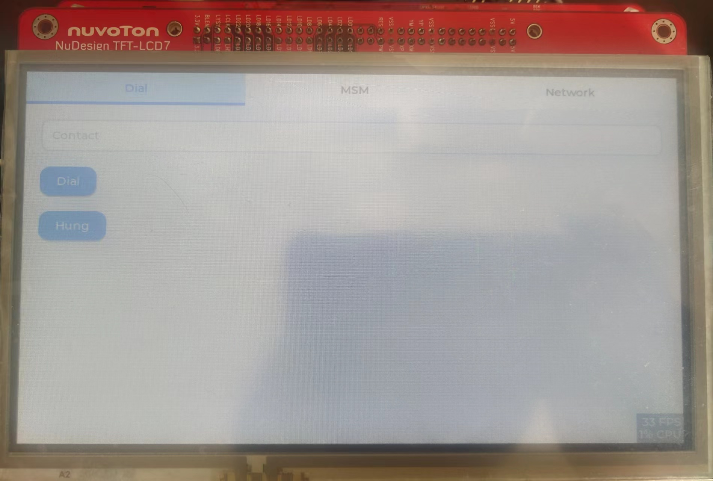
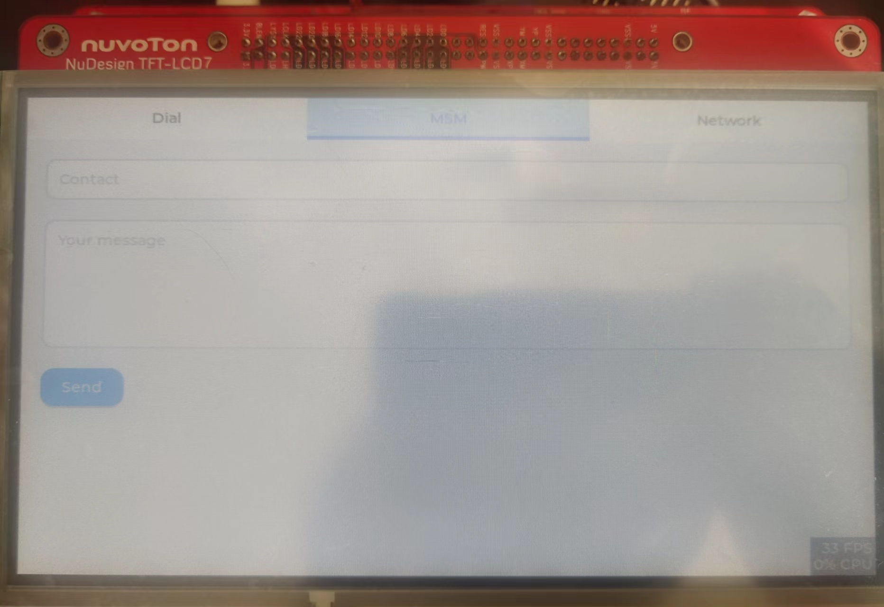
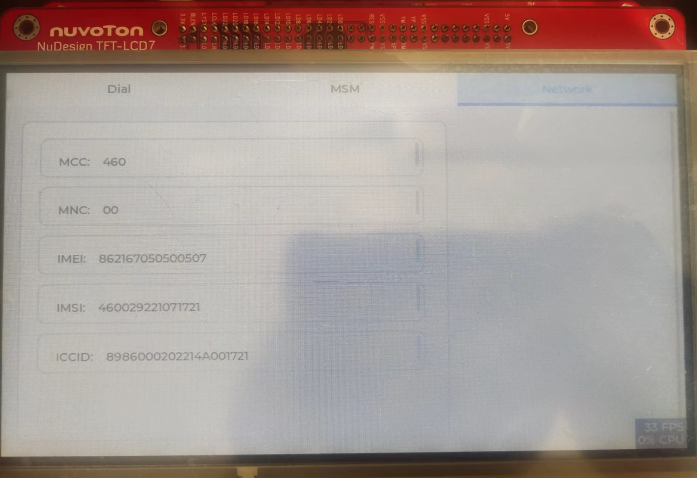

# Telephony Demo based on LVGL and NK-N9H30
## Background
When discussing telephony-related applications, Android is the first thing most people think of. Obviously, the graphics framework and cellular communication solutions offered by Android are undoubtedly the most complete and powerful at present. But when we want to deploy telephony applications in resource-constrained MCUs, especially those with graphical interfaces, there don't seem to be so many options.

RT-Thread is a real-time operating system with very rich third-party components, [AT Component](https://www.rt-thread.org/document/site/#/rt-thread-version/rt-thread-standard/programming-manual/at/at)provides a relatively complete AT command parsing interface and supports many mainstream 4G modules. [LVGL](https://lvgl.io/) is the most popular free and open source embedded graphics library to create beautiful UIs for any MCU, MPU and display type. It will easy beed called by APP in RT-Thread, if we develop a suite of API&Demo based on AT component of RT-Thread and LVGL. This demo will is a shallow attempt.

  

## Feature
We focus on dial, message, network copoments, there are features to implement：
1. Dial, anwser, hung, and display incoming 
2. Send and recive message
3. network info, like MCC, MNC, ICCID, IMSI and Cell ID.
## Architecture
Using Air724 as the 4G module, NK-N9H is connected to the 4G module through uart1

As for software, the two components of LVGL and AT are mainly integrated, and the official has adapted the LVGL driver for us and can be used directly.

## Implement
### Dial
#### Success process

#### Failed process

### Anwser

### Hang up

### Send and Recive Msg
PDU parsing is a very, very complicated thing, and I may not be able to figure this out for a while and a half, so the short message is only in txt format

### Network information
The process of get network information is relatively simple, and it is all AT commands sent and received in real time, so only the AT commands used are listed

| Function | Command | Response |
| -- | -- | -- |
| Get PLMN | AT+COPS? | +COPS: \<mode\>[,\<format\>,\<oper\>[,< AcT>>[, <Domain\>]]] OK
| Get signal strength | AT+CSQ | +CSQ: <rssi>,<ber> OK
| Get IMEI | AT+CGSN | \<IMEI\> OK
| Get IMSI | AT+CIMI | \<IMSI\> OK
| Get ICCID | AT+ICCID | +ICCID:<iccid> OK

## Presentation
### Assembly Display

### Dial Page

### Message Page

### Network Page

### Video
[Bilibili](https://www.bilibili.com/video/BV1wd4y1P7gZ?spm_id_from=333.337.search-card.all.click)

## Summary
I would like to thank Nuvoton & RT-Thread & LVGL for launching this activity, because it allowed me to experience a quick prototyping function like building blocks. Due to my general aesthetics, coupled with the fact that I came into contact with LVGL for the first time, I apologize for making things that don't seem to be beautiful at all. Telephone is a very large and very complex system, and this time I have shallowly tried some of the functional development of the dial and network components, and will continue to explore further in the future when there is time and opportunity.